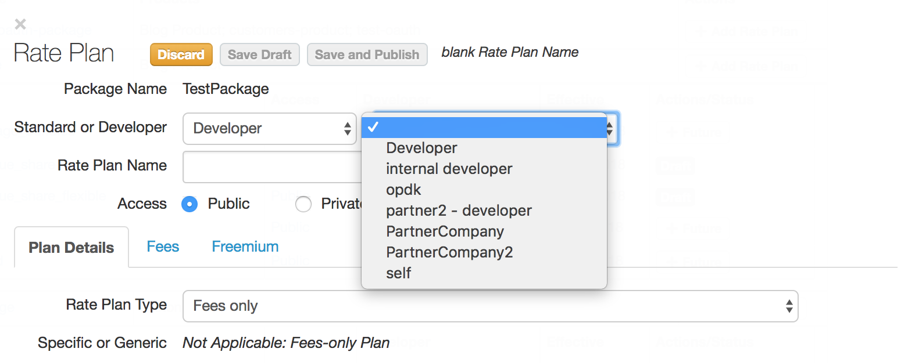
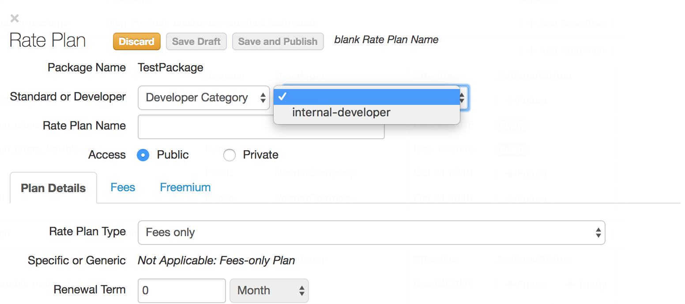
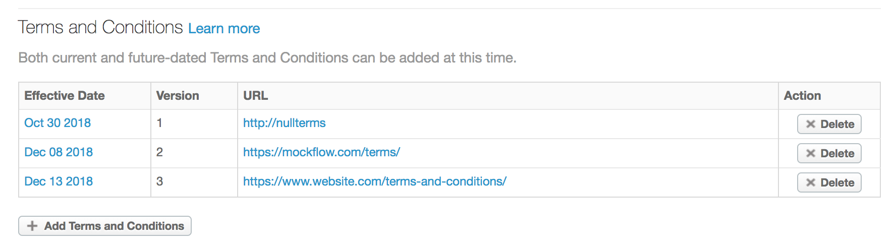
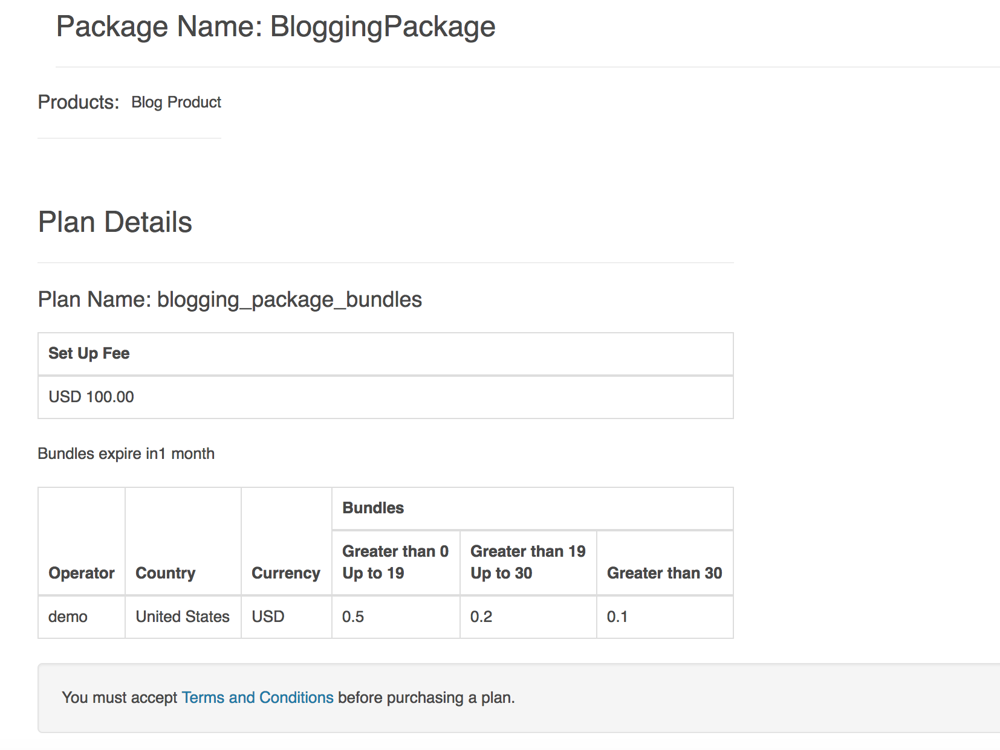

# apigee-monetization-demo

This repository walks through some basic use cases of how to configure Monetization on Edge as well as on the Drupal Developer Portal.  I will only describe the default behavior without any customization.   

## Assumptions
This documentation assumes that you are familiar with [Apigee Monetization concepts](https://docs.apigee.com/api-platform/monetization/basics-monetization) and that you are comfortable setting up [Monetization rate plans](https://docs.apigee.com/api-platform/monetization/create-rate-plans).

## Limiting a Rate Plan to subset of developers
Use Case: I want to restrict a rate plan to a subset of developers (e.g. internal only) or a specific developer.

If you want to limit a rate plan to subset of developers, then there are two ways to accomplish this:
1. Create a [developer category](https://docs.apigee.com/api-platform/monetization/manage-developer-categories#ui), then select that developer category when you create the rate plan
2. Specify a developer when you create the rate plan

### Restrict to a specific developer
1. [Create an API Package](https://docs.apigee.com/api-platform/monetization/create-api-packages)
2. [Create a rate plan](https://docs.apigee.com/api-platform/monetization/create-rate-plans) and then select 'Developer' as the **Standard or Developer** option. Once you select this option the rate plan will only be available for that specific developer.

### Restrict to a subset of developers
1. [Create a developer category](https://docs.apigee.com/api-platform/monetization/manage-developer-categories#ui).
2. [Create an API Package](https://docs.apigee.com/api-platform/monetization/create-api-packages)
3. [Create a rate plan](https://docs.apigee.com/api-platform/monetization/create-rate-plans) and then Select 'Developer Category' as the **Standard or Developer** option. **There may be a delay before your developer category is displayed in the drop-down menu.**

## Terms and Conditions
If an administrator adds a new terms and conditions to the Organization's profile (Edge -> Admin > Organization Profile), then the developer must accept the new terms and conditions before they purchase a new rate plan.  

### Adding new terms and conditions
After adding new terms and conditions.

### Developer must accept new terms...
The screen shot below displays the message "You must accept the Terms and Conditions before purchasing a plan."

However, a developer can continue to use the plans they purchased previously without interruption, even if they don't accept the new terms and conditions.  
