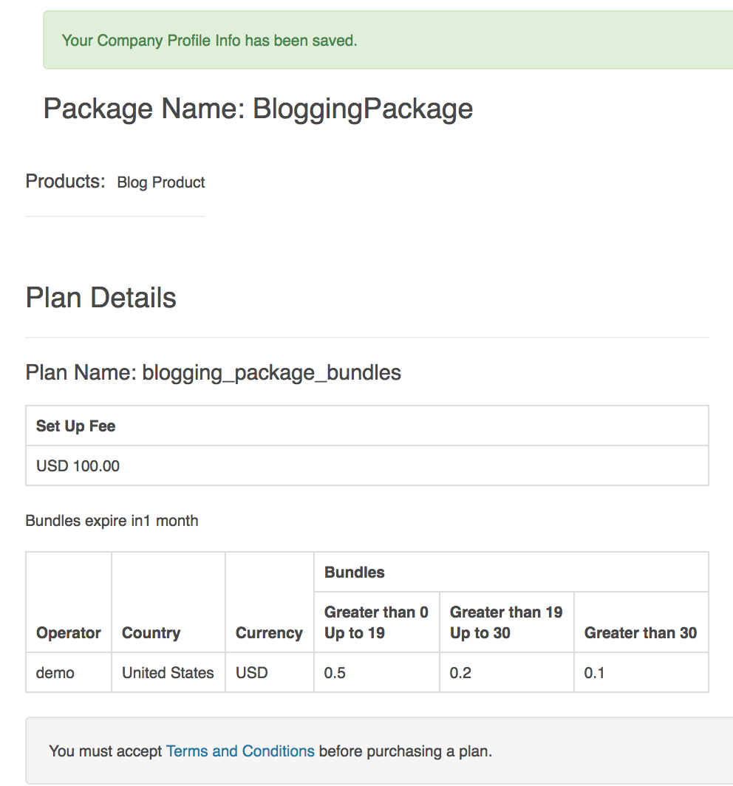

# apigee-monetization-demo

This repository walks through some basic use cases of how to configure Monetization on Edge as well as on the Drupal Developer Portal.  I will only describe the default behavior without any customization.   

## Assumptions
This documentation assumes that you are familiar with [Apigee Monetization concepts](https://docs.apigee.com/api-platform/monetization/basics-monetization) and that you are comfortable setting up [Monetization rate plans](https://docs.apigee.com/api-platform/monetization/create-rate-plans).

## TOC
* [Prepaid Developer Flow](#prepaid-developer-flow)
* [Limiting a Rate Plan to subset of developers](#limiting-a-rate-plan-to-subset-of-developers)
* [Terms and Conditions](#terms-and-conditions)
* [Change which role has access to the Monetization Role in Developer Portal](#change-which-role-has-access-to-the-monetization-role-in-developer-portal)

## Prepaid Developer Flow
The following is the general flow for prepaid developers.  

1. Developer attempts to purchase a rate plan.

2. Before they can purchase a rate plan they must create a company.  This is not a [company](https://docs.apigee.com/api-platform/monetization/manage-companies-developers) in Apigee Edge which can have multiple developer associated with it.

3. Developer must enter their company info.  This info is used as the billing address to the payment provider. Notice that this developer is a 'prepaid' developer.

4. The developer must accept the terms and conditions.

5. The developer accepts the terms and conditions.

6. Now the developer is able to purchase the plan.

7. If they don't have sufficient funds on their account then they must add money to their account.

8. The checkout form is display and auto-populated with the information the developer entered on the company details page.

9. Developer can review their order. In this case the default WorldPay account is already configured and setup.

10. Developer is directed to the WorldPay site to enter their credit card information.

11. TODO
Need to show other screen shots of credit card flow.

## Limiting a Rate Plan to subset of developers
Use Case: I want to restrict a rate plan to a subset of developers (e.g. internal only) or a specific developer.

If you want to limit a rate plan to subset of developers, then there are two ways to accomplish this:
1. Create a [developer category](https://docs.apigee.com/api-platform/monetization/manage-developer-categories#ui), then select that developer category when you create the rate plan
2. Specify a developer when you create the rate plan

### Restrict to a specific developer
1. [Create an API Package](https://docs.apigee.com/api-platform/monetization/create-api-packages)
2. [Create a rate plan](https://docs.apigee.com/api-platform/monetization/create-rate-plans) and then select 'Developer' as the **Standard or Developer** option. Once you select this option the rate plan will only be available for that specific developer.

### Restrict to a subset of developers
1. [Create a developer category](https://docs.apigee.com/api-platform/monetization/manage-developer-categories#ui).
2. [Create an API Package](https://docs.apigee.com/api-platform/monetization/create-api-packages)
3. [Create a rate plan](https://docs.apigee.com/api-platform/monetization/create-rate-plans) and then Select 'Developer Category' as the **Standard or Developer** option. **There may be a delay before your developer category is displayed in the drop-down menu.**

## Terms and Conditions
If an administrator adds a new terms and conditions to the Organization's profile (Edge -> Admin > Organization Profile), then the developer must accept the new terms and conditions before they purchase a new rate plan.  

### Adding new terms and conditions
After adding new terms and conditions.

### Developer must accept new terms...
The screen shot below displays the message "You must accept the Terms and Conditions before purchasing a plan."

However, a developer can continue to use the plans they purchased previously without interruption, even if they don't accept the new terms and conditions.  

## Change which role has access to the Monetization Role in Developer Portal
The default monetization settings require the developer to be included as a 'Monetization Administrator' so that they can see the 'Monetization' menu. If a developer does not have access to this menu then they will not be able to purchase any rate plans.  

You can change this setting so that the Monetization role is associated to either the Developer or Finance administrator.
1. Login to your Developer Portal as an Administrator.

2. Click 'Configuration' > 'Monetization settings'

3. On this menu you change the 'Monetization role' to apply to the:
  * 'Developer'
  * 'Finance Administrator'
  * 'Monetization Administrator'

